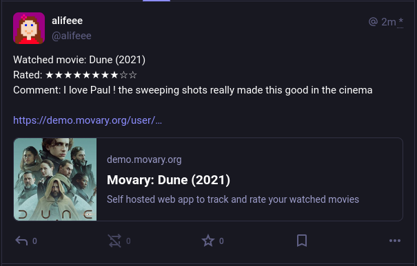

## Cross-posting

### Description

Movary can post each movie play or watchlist addition to a Mastodon account via the [`Post a new status`](https://docs.joinmastodon.org/methods/statuses/#create) Mastodon API.



The Mastodon Post for a new (or changed) movie play contains:

- Movie Title and Year
- Movie user rating (OPTIONAL: Only if user rating exists)
- Movie user play comment (OPTIONAL: Only if user comment exists)
- Movary URL of the movie 

### Instruction

!!! warning
    Do not share the API key with anyone or they will be able to post statuses to your Mastodon account

1. Enable Mastodon integration via the settings page on Movary (`/settings/integrations/mastodon`)
2. Set your username (e.g. @username@mastodon.social) and Access Token (needs `write:statuses` access)
3. Optional: Make sure to adjust your Mastodon Post visibility if necessary
4. Save your settings
5. Optional: Use the `Test` button to create a test Mastodon post to verify your **saved** settings
6. You can now see a "**Post to Mastodon**" checkbox when you add a movie
    

## CLI Commands

```bash
# Post play addition to mastodon
php bin/console.php mastodon:post:play --userId=1 --movieId=1 --watchDate=today

# Post watchlist addition to mastodon
php bin/console.php mastodon:post:watchlist --userId=1 --movieId=1
```
