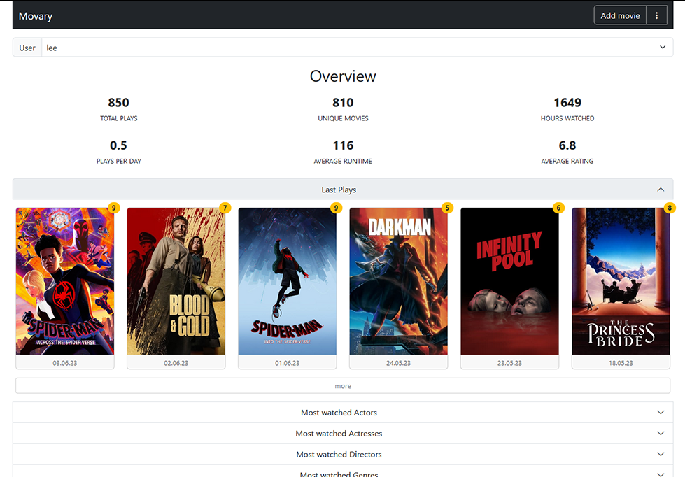

<h1 align="center">
   
  
   
  Movary
   
</h1>

<h4 align="center">The central hub to track, rate and explore your movie watch history</h4>

<a href="https://movary.org" target="_blank" rel="noopener noreferrer">Website</a> •
<a href="https://docs.movary.org/install/docker/" target="_blank" rel="noopener noreferrer">Installation</a> •
<a href="https://docs.movary.org/" target="_blank" rel="noopener noreferrer">Docs</a> •
<a href="https://api.movary.org/" target="_blank" rel="noopener noreferrer">Api</a> •
<a href="https://demo.movary.org/" target="_blank" rel="noopener noreferrer">Demo</a>

Movary is a free and open source web application to track, rate and explore your movie watch history.
You can host it for yourself and others.
It offers detailed statistics, 
third-party integrations for importing and exporting your history from platforms like Trakt, Letterboxd, or Netflix,
automated play tracking for Plex, Jellyfin or Emby and much [more](#features).

**Disclaimer:** This project is still in an experimental (but usable) state.
There are plans to add more and improve existing features before creating the 1.0 Release,
which can lead to sudden breaking changes from time to time, so keep the release notes in mind when updating until then.

## Features

- Movie watch history: Collect and manage your watch history and ratings
- Statistics: Analyze your movie watching behavior and history, like e.g. most watched actors/directors/genres/languages/years
- Customization: You decide how your dashboard should look like, what format to use when displaying dates and more
- Third party integrations: Import and export your history and ratings from/to platforms like Trakt, Letterboxd, or Netflix
- Scrobbler: Automatically add new plays and ratings from Plex, Jellyfin or Emby
- Own your personal data: Users can decide who can see their data and export/import/delete the data and their accounts at any time
- Locally stored metadata: Using e.g. themoviedb.org and imdb as sources, all metadata movary uses for your history entries can be stored locally
- PWA: Can be installed as a smartphone app ([How to install PWAs in chrome](https://support.google.com/chrome/answer/9658361?hl=en&co=GENIE.Platform%3DAndroid&oco=1))
- User-management: Use Movary alone or with others
- Completely free, no ads, no tracking and open source! :)

## Demo

A demo installation can be found [here](https://demo.movary.org/) (User: `testUser@movary.org` Password:`testUser`).

## Documentation

The documentation for the latest release is located [here](https://docs.movary.org). Please report missing or wrong information.

## Support

- Please report bugs and request features/changes via [Github issues](https://github.com/leepeuker/movary/issues/new/choose)
- Ask for help or discuss related topics via [Github discussions](https://github.com/leepeuker/movary/discussions)
- Join our [Discord server](https://discord.gg/KbcSqggrgW)

## Contributors

* [@leepeuker](https://github.com/leepeuker) as Lee Peuker
* [@JVT038](https://github.com/JVT038) as JVT038
* [@pbogre](https://github.com/pbogre) as Pietro Bonaldo Gregori
